

  

# ***AHB Direct Access Memory Controller (DMAC)***

## Designed By:
- [Muhammad Mouzzam](https://github.com/MuhammadMouzzam)
- [Danish Hassan](https://github.com/Danish-Hassann)

## File Structure
- [Code](code/)
  - [RTL](code/rtl/)
    - [Mock Peripheral/Buffer](code/rtl/Buffer.sv)
    - [DMAC Module](code/rtl/Dmac.sv)
    - [DMAC Datapath](code/rtl/Dmac_Main_Datapath.sv)
    - [DMAC Controller](code/rtl/Dmac_Main_Ctrl.sv)
    - [DMAC Channel](code/rtl/Dmac_Channel.sv)
    - [DMAC Channel Datapath](code/rtl/Dmac_Channel_Datapath.sv)
    - [DMAC Channel Controller](code/rtl/Dmac_Channel_Ctrl.sv)
    - [FIFO](code/rtl/Fifo_Datapath.sv)
  - [Verification](code/verif/)
    - [DMAC's TestBench](code/verif/Dmac_tb.sv)
    - [DMAC Channel's TestBench](code/verif/Dmac_Channel_tb.sv)
- [Documents and Images](docs/)
- [Makefile](makefile)
  

## **Table of Contents:**
- [Introduction](#introduction)
- [Specifications](#specifications)
- [DMAC](#dmac)
  - [Block Diagram/Pinout](#block-diagrampinout)
  - [Signals](#signals)

    - [Request and Response Interface](#request-and-response-interface)
    - [Control and Interrupt Interface](#control-and-interrupt-interface)
    - [Master Interface](#master-interface)
  - [Working Pipeline](#working-pipeline)
    - [Request from Peripheral](#request-from-peripheral)
    - [Enabling Channels](#enabling-channels)
    - [Transfer Completion and Disabling DMAC](#transfer-completion-and-disabling-dmac)
  - [DMAC Datapath](#dmac-datapath)
  - [DMAC Controller](#dmac-controller)
    - [Internal Signals](#internal-signals)
    - [State Transition Graph](#state-transition-graph)
    - [States](#states)
- [DMAC Channel](#dmac-channel)
  - [Pinout](#pinout)
  - [Signals](#signals-1)
  - [Description](#description)
  - [Working Pipeline](#working-pipeline-1)
    - [Operation](#operation)
    - [Configuration](#configuration)
    - [Start Condition](#start-condition)
    - [Data Transfer](#completion)
  - [Registers](#registers)
  - [DMAC Channel Datapath](#dmac-channel-datapath)
  - [DMAC Channel Controller](#dmac-channel-controller)
    - [Internal Signals](#internal-signals-1)
    - [State Transition Graph](#state-transition-graph-1)
    - [States](#states-1)

## **Introduction**
A Direct Memory Access Controller (DMAC) is a hardware module designed to facilitate efficient data transfers between memory and peripherals, or between two peripheral devices, without heavily involving the processor (CPU). This mechanism allows data movement to occur in the background, freeing the CPU to execute other instructions or handle high-priority tasks.

When the CPU is tasked with handling data transfers directly, it typically becomes blocked — it must wait and perform each individual read and write operation. This process consumes valuable processor cycles and significantly hampers overall system performance, especially when dealing with large volumes of data. To alleviate this bottleneck, the DMAC takes over the responsibility of managing the transfer and temporarily gains control of the system bus.

Once granted control, the DMAC autonomously carries out the data transfer between source and destination addresses using its own internal logic. After completing the transfer, it relinquishes the bus back to the CPU, generating an interrupt to signal completion.

***Transfer Types:*** DMAC supports two fundamental types of data transfers:

- **Burst Transfer**
In burst mode, the DMAC collects data into a FIFO buffer. Once the buffer reaches the defined burst size, transfer starts. Data is sent in a continuous sequence without interruption. This reduces bus arbitration and improves throughput. Best suited for large data blocks or high-speed devices. However, it can monopolize the bus during the burst. Careful arbitration is needed in multi-master systems.

- **Single Transfer**
In single mode, one data item is moved at a time. It is used when a peripheral only has 1 word to transfer. Ideal for low-latency or real-time applications. Overhead is higher due to repeated bus arbitration. More predictable and fair in shared-bus environments. Recommended for small or sporadic data transfers.

## **Specifications**
- Number of Channels: 2
- Fixed Priority Channels
  - Highest priority: `Channel 1`
  - Lowest priortity: `Channel 2`
- Maximum Burst Transfer Capability: `16 beats`
- Endianness: `Little-Endian`
- Invariance: `byte invariant`
- Highest priority to `DmacReq[1]` Request - Assigned `Channel 1`
- FIFO depth in Each Channel: 16 words
- Supported Peripherals/Slaves: 2
- Capable of Burst and Single transfer
  - 4 32-bit Registers:
    - Control Register - `Ctrl_Reg `
    - Size Register - `Size_Reg`
    - Source Address Register -  `SAddr_Reg`
    - Destination Address Register - `DAddr_Reg`
- Request and Response Interface: For peripherals
- If CPU asks for bus access, burst transfer is halted until bus access is granted again.

## ***DMAC***

## **Block Diagram/Pinout**

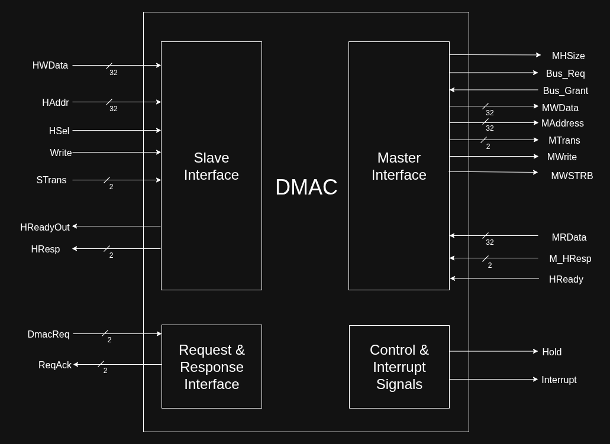

## **Signals:**

### ***Request and Response Interface***
| `Signals` | Type   | Width | Purpose                                            |
| --------- | ------ | ----- | -------------------------------------------------- |
| `DmacReq` | Input  | 2     | Each bit indicates a request from each peripheral  |
| `ReqAck`  | Output | 2     | Request Acknowledgement Signals to each peripheral |

### ***Control and Interrupt Interface***
| Signals     | Type   | Width | Purpose                                          |
| ----------- | ------ | ----- | ------------------------------------------------ |
| `Interrupt` | Output | 1     | Signals to CPU that transfer is complete         |

### ***Master Interface***
| Signals     | Type   | Width | Purpose                                                                                   |
| ----------- | ------ | ----- | ----------------------------------------------------------------------------------------- |
| `Bus_Req`   | Output | 1     | Requests Bus' Arbiter to become Bus Master (Remains asserted until Bus_Grant is asserted) |
| `Bus_Grant` | Input  | 1     | Signals DMAC that bus access is granted to it                                             |
| `MWData`    | Output | 32    | Data to write to Slave as a master                                                        |
| `MAddress`  | Output | 32    | Address to Slave as a master                                                              |
| `MTrans`    | Output | 2     | Tells the state of the current transfer Request on bus as a master                        |
| `MWrite`    | Output | 1     | As a master, tells the slave the nature of the transfer Request                           |
| `MRData`    | Input  | 32    | Data Read from the Slave                                                                  |
| `HReady`    | Input  | 1     | Signals DMAC that the transfer request is complete                                        |
| `M_HResp`   | Input  | 2     | From slave to master, tells if the transfer was successful or not                         |
| `MHSize`    | Output | 2     | Tells the size of the single transfer i.e. `byte`, `halfword` or `word`                   |
| `MWSTRB`    | Output | 4     | `4` bit signal, each bit represents a valid `byte` in a `word`                            |

## **Working Pipeline:**
This DMAC has been designed as to follow a certain pipeline to complete the transfer. The pipeline is as follows:

    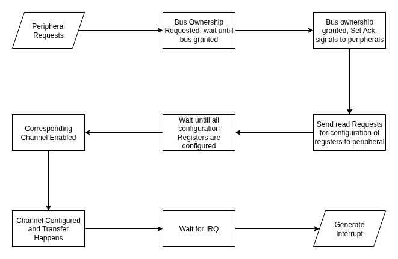

### **Request from Peripheral**

When a peripheral issues a transfer request to the DMAC, the DMAC automatically stores the peripheral’s base address into the Peripheral Address Register (`peri_addr_reg`). This allows the DMAC to configure itself for the transfer. In addition, the request bits are stored in a register (`DmacReq_Reg`) for later use in enabling the corresponding channels.

1. **Channel Priority**
   - `DmacReq[1]` has the highest priority and enables `Channel 1` to handle the transfer.
   - If both request signals are asserted simultaneously, the DMAC ignores `DmacReq[0]` and does not assert its corresponding request acknowledge signal `ReqAck[1]`. The requesting slave(s) must hold its/their request(s) active until the acknowledgement signal is received.
   - `Channel 2` is assigned to service `DmacReq[0]`.

2. **Bus Request**
Once a valid peripheral request is detected, the DMAC asserts the Bus Request (`Bus_Req`) signal to the AHB arbiter to request access to the bus. This signal remains asserted for the entire transfer to ensure bus ownership, even if a higher-priority master attempts to acquire the bus.

1. **Bus Arbitration**
After being triggered by the peripheral, control transitions to the Bus Request (`Bus Reqd.`) state. In this state, the DMAC waits until the arbiter asserts Bus Grant (`Bus_Grant`), granting bus access and allowing the transfer to proceed.

---

### **DMAC Configuration**

- Once bus is granted, DMAC uses `peri_addr_reg` (peripheral base address) + register offsets to generate read requests.  
- All peripherals must implement identical offsets for uniform access.  
- During this, `con_sel = 2`, sending requests directly to the master interface (bypassing channels).  
- Data read is stored into DMAC configuration registers, each with a wait state:  
  - **Wait for Src** → `SAddr_Reg`  
  - **Wait for Dst** → `DAddr_Reg`  
  - **Wait for Trans. Size** → `Size_Reg`  
  - **Wait for Ctrl** → `Ctrl_Reg`  

- Configuration sequence (strictly ordered):  
  1. `SAddr_Reg`  
  2. `DAddr_Reg`  
  3. `Size_Reg`  
  4. `Ctrl_Reg`  

- Control transitions:  
  - `Bus Reqd.` → `Wait for Src` → sequential wait states → `Wait for Ctrl`.  
  - Transition from `Bus Reqd.` to `Wait for Src` also asserts the `ReqAck` bit (based on `DmacReq_Reg`).  

### **Enabling Channels**

- After configuration, `DmacReq_Reg` determines which channel to enable:
  - `MSB_Req`: entered when `DmacReq_Reg[1]` = 1 → enables **Channel 1**.  
  - `LSB_Req`: entered when `DmacReq_Reg` = `01` → enables **Channel 2**.  

- Once enabled, control moves to the **Wait** state, where DMAC waits for transfer completion.  

- If `Bus_Grant` is deasserted:
  - DMAC releases the bus, halts transfer, and deasserts channel enable.  
  - Control returns to `MSB_Req` or `LSB_Req` based on `new_con_sel` (previously selected channel).  

- DMAC then re-requests the bus and resumes transfer until completion.

### **Transfer Completion and Disabling DMAC**
1. After the channel has been enabled, Now the DMAC waits for `irq` which signals transfer completion from the channel's side. During the transfer, it is important to decide which channel should output the data to the master interface. To do that, a mux is used with `con_sel` signal as selector. This `con_sel` is also given to a FlipFlop and the output of the FlipFlop, `new_con_sel` is the input to the controller of the DMAC, which informs which channel was enabled previously. `0` means `channel 1`, `1` means `channel 2`.
2. Once `irq` is asserted, DMAC asserts the `Interrupt` flag to signal the CPU about the completion of transfer, that means the CPU can take the Bus access.

---

## **DMAC DataPath**

  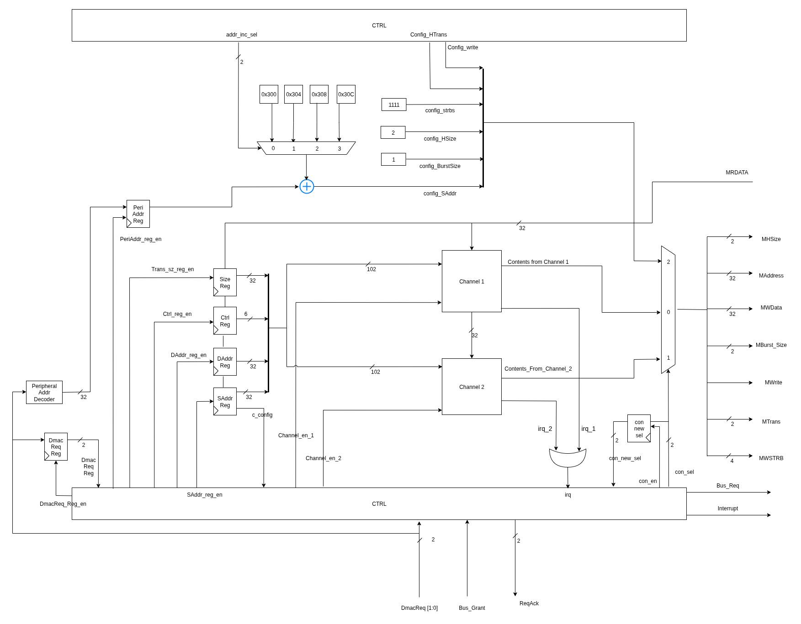

## **DMAC Controller**
### **Internal Signals**
| Signal            | Type   | Purpose                                                                 |
| ----------------- | ------ | ----------------------------------------------------------------------- |
| `irq`             | Input  | OR of `irq_1` and `irq_2` from both channels, indicates transfer done   |
| `con_sel`         | Output | Selector of a mux to output the data from the enabled channel           |
| `con_new_sel`     | Input  | Feedback from Flip-Flop storing previous value of `con_sel`              |
| `Bus_Req`         | Output | Signal to request access of the bus from the bus' Interconnect          |
| `Bus_Grant`       | Input  | Signals that the bus Request was acknowledged and bus access granted    |
| `Interrupt`       | Output | Signals the Completion of the current transfer                          |
| `c_config`        | Input  | When asserted, tells that the slave interface has been configured       |
| `con_en`          | Output | Enable signal for the Flip-Flop to store `con_sel`                      |
| `Channel_en_1`    | Output | Enable for Channel 1                                                    |
| `Channel_en_2`    | Output | Enable for Channel 2                                                    |
| `DmacReq`         | Input  | Each bit represents a request to DMAC for data transfer from peripheral |
| `ReqAck`          | Output | Each bit is a Request Acknowledgment signal for each peripheral         |
| `DmacReq_Reg_en`  | Output | Enable to latch `DmacReq` into `DmacReq_Reg`                            |
| `SAddr_Reg_en`    | Output | Enable for Source Address Register                                      |
| `DAddr_Reg_en`    | Output | Enable for Destination Address Register                                 |
| `Trans_sz_Reg_en` | Output | Enable for Transfer Size Register                                       |
| `Ctrl_Reg_en`     | Output | Enable for Control Register                                             |
| `PeriAddr_reg_en` | Output | Enable for Peripheral Address Register                                  |
| `addr_inc_sel`    | Output | Selector for address increment scheme (Src/Dst/TSize/Ctrl sequence)     |
| `config_write`    | Output | Write enable during configuration phase                                 |
| `config_HTrans`   | Output | Transfer type during configuration (Idle, Busy, Non_Seq, Seq)           |
| `HReady`          | Input  | Indicates bus is ready for the next transfer                            |

### **State Transition Graph:**

  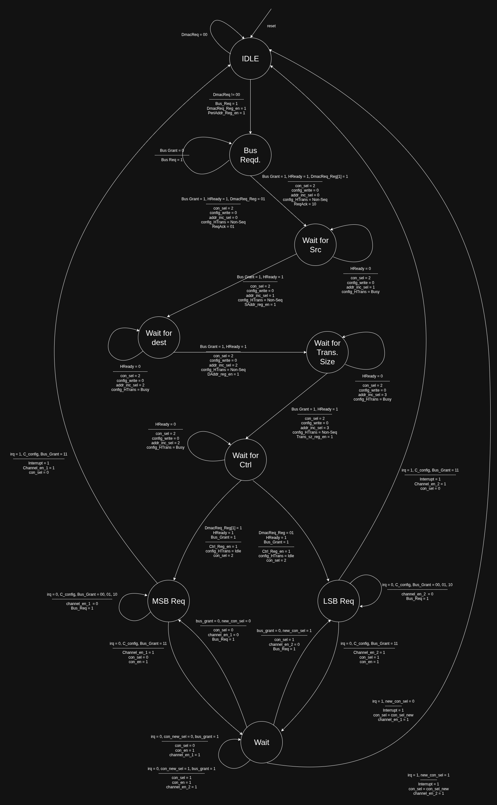

### **States:**
| State     | Purpose                                                                          |
| --------- | -------------------------------------------------------------------------------- |
| `Idle`    | The which indicates the DMAC is not handling any Requests                        |
| `BUS_REQD`          | DMAC has latched the request and asserts `Bus_Req`, waits for `Bus_Grant` and sends read request to peripheral for reading the Source Address.   |
| `WAIT_FOR_SRC`      | Fetches and writes the **Source Address Register** once the bus is granted.   |
| `WAIT_FOR_DST`      | Fetches and writes the **Destination Address Register**.                                |
| `WAIT_FOR_TRANS_SIZE` | Configures the **Transfer Size Register** for the data transfer.                           |
| `WAIT_FOR_CTRL`     | Configures the **Control Register** of DMAC, decides whether MSB or LSB request to serve.   |
| `MSB Req` | State indicating that the peripheral with a higher priority has made the request |
| `LSB`     | State indicating that the peripheral with a lower priority has made the request  |
| `Wait`    | A wait state until the transfer is complete                                      |

## **DMAC Channel**
## **Pinout:**

  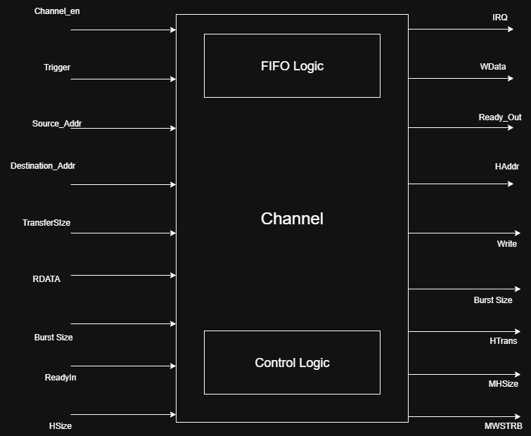

## **Signals:**
| Signals            | Type   | Width | Purpose                                                                       |
| ------------------ | ------ | ----- | ----------------------------------------------------------------------------- |
| `Channel_en`       | Input  | 1     | Enables the channel.                                                          |
| `Source_Addr`      | Input  | 32    | The starting memory location from which data is read during a transfer.       |
| `Destination_Addr` | Input  | 32    | The starting memory location to which data will be written during a transfer. |
| `Transfer_Size`    | Input  | 32    | Specifies the total number of words to transfer.                              |
| `Burst_Size`       | Input  | 4     | Indicates the number of beats in a burst transfer.                            |
| `RData`            | Input  | 32    | Data read from the slave during a DMA read operation.                         |
| `ReadyIn`          | Input  | 1     | Indicates whether the processor is ready to send the data.                    |
| `HSize`            | Input  | 2     | Specifies the size of each transfer: byte (00), halfword (01), word (10).     |
| `Irq`              | Output | 1     | Interrupt signal raised when the DMA transfer is complete.                    |
| `WData`            | Output | 32    | Data to be written to the destination address during a DMA write operation.   |
| `Ready_Out`        | Output | 1     | Indicates that the DMA controller is ready to perform a transfer.             |
| `HAddr`            | Output | 32    | Address sent to the AHB Bus for the read/write operation.                     |
| `Write`            | Output | 1     | Indicate write operation when asserted and read when 0.                       |
| `Burst_Size`       | Output | 4     | Indicate number of beats in a burst transfer.                                 |
| `HTrans`           | Output | 2     | Transfer type on the AHB bus (IDLE,BUSY NONSEQ, SEQ).                         |
| `MHSize`           | Output | 2     | Specifies the size of each transfer: byte (00), halfword (01), word (10).     |
| `MWSTRB`           | Output | 4     | Indicates which byte(s) are active during a write.                            |

## Description: 
The DMAC (Direct Memory Access Controller) channel is responsible for autonomously transferring data between a source and destination without CPU intervention. It is designed to support both single transfers (one word per transaction) and burst transfers (multiple words per transaction), providing flexibility for various use cases.

Each channel includes a dedicated FIFO buffer, which temporarily holds data during burst operations. Once the data has been successfully transferred, the channel automatically generates an interrupt to notify the CPU that the operation is complete.

## Working Pipeline: 

  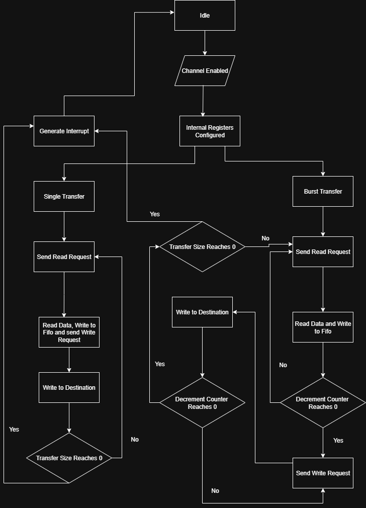

### Operation

The DMA channel operates through a **finite state machine (FSM)** that governs the control and flow of data. The following outlines the step-by-step operation:

---

### Configuration
- When a **transfer request** is received from a peripheral, the CPU configures the DMAC by writing to the following registers:
  - `SAddr_Reg`: Source memory address
  - `DAddr_Reg`: Destination memory address
  - `Size_Reg`: Total number of bytes or words to transfer
  - `Ctrl_Reg`: Burst size and other control/configuration bits

---

### Start Condition
- The transfer begins when the **`channel_en`** signal for the selected channel is asserted.
- The FSM transitions from the **IDLE** state to the **ENABLED** state.
- During this transition, the following internal registers are loaded from the previously configured values:
  - `Src_Addr`: Latched source address
  - `Dst_Addr`: Latched destination address
  - `Size_Reg`: Size of the transfer
  - `Burst_Size`: Number of words to be transferred per burst

---

### Data Transfer
- **Process Flow**  
  - Issues **read request** to source → increments source address.  
  - Stores valid data in **FIFO**.  
  - Issues **write request** to destination → increments destination address.  
  - Repeats until full transfer completes.  

- **Burst Mode**  
  - Reads multiple items into FIFO, then writes sequentially.  
  - If `transfer_size` is a multiple of `burst_size` → all data transferred in bursts.  
  - Otherwise → largest possible bursts used, remainder (`transfer_size % burst_size`) done via single transfers.  

- **MWSTRB (Write Strobe Signal)**  
  - Indicates which **byte** (if `HSize = byte`) or **halfword** (if `HSize = halfword`) is valid in the transferred word.  
  - Each `MWSTRB` combination maps to valid bytes in a word.  

| Data Size  | Address Offset | MWSTRB | HWDATA[31:24] | HWDATA[23:16] | HWDATA[15:8] | HWDATA[7:0] |
| ---------- | -------------- | ------ | ------------- | ------------- | ------------ | ----------- |
| `word`     | `0`            | `1111` | Valid         | Valid         | Valid        | Valid       |
| `halfword` | `0`            | `0011` |               |               | Valid        | Valid       |
| `halfword` | `2`            | `1100` | Valid         | Valid         |              |             |
| `byte`     | `0`            | `0001` |               |               |              | Valid       |
| `byte`     | `1`            | `0010` |               |               | Valid        |             |
| `byte`     | `2`            | `0100` |               | Valid         |              |             |
| `byte`     | `3`            | `1000` | Valid         |               |              |             |

---

### Completion
- After the final data word is transferred:
  - The FSM returns to the **IDLE** state.
  - The DMA channel asserts an **interrupt signal** to the CPU to indicate successful completion.

---

## Registers

| Register Name       | Width | Description                                                                                                                                                                                                 |
| ------------------- | ----- | ----------------------------------------------------------------------------------------------------------------------------------------------------------------------------------------------------------- |
| `Src_Addr`          | 32    | Source memory address                                                                                                                                                                                       |
| `Dst_Addr`          | 32    | Destination memory address                                                                                                                                                                                  |
| `Transfer_Size`     | 32    | Total number of words to transfer                                                                                                                                                                           |
| `Burst_Size`        | 32    | Number of words to be transferred per burst                                                                                                                                                                 |
| `Decrement_Counter` | 32    | Tracks the remaining number of data items to be read or written in the current burst. It decrements with each successful transfer and resets to `Burst_Size` at the start of every new read or write burst. |
| `HSize_Reg`         | 2     | Stores the size of transfer: byte (00), halfword (01), word (10).                                                                                                                                           |

## **DMAC Channel DataPath**

  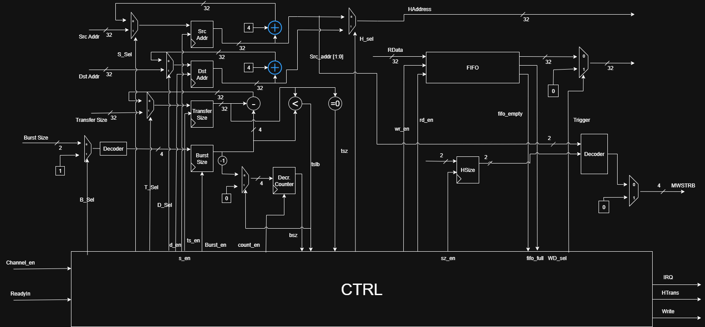

## **DMAC Channel Controller**

### **Internal Signals**
| Signal       | Type   | Purpose                                                                                                                 |
| ------------ | ------ | ----------------------------------------------------------------------------------------------------------------------- |
| `channel_en` | Input  | Enables the currently selected DMA channel.                                                                             |
| `readyIn`    | Input  | Indicates whether the source is ready to provide data.                                                                  |
| `fifo_full`  | Input  | Indicates the internal FIFO is full and cannot accept more data.                                                        |
| `fifo_empty` | Input  | Indicates the internal FIFO is empty and no data is available to send.                                                  |
| `bsz`        | Input  | Asserted when decrement counter stores 0, indicating current read/write burst is done.                                  |
| `tslb`       | Input  | Asserted when transfer size is less than burst size, used to indicate that the next transfers will be single transfers. |
| `tsz`        | Input  | Asserted when transfer size reaches 0.                                                                                  |
| `M_HResp`    | Input  | Response from Dmac indicating transfer success or failure.                                                              |
| `irq`        | Output | Interrupt raised when the DMA transfer is complete.                                                                     |
| `HTrans`     | Output | Specifies transfer type (IDLE, BUSY, NONSEQ, SEQ).                                                                      |
| `write`      | Output | Indicates direction of transfer: 1 for write, 0 for read.                                                               |
| `b_sel`      | Output | Selects Burst_Size = 1 for single transfer when asserted.                                                               |
| `d_sel`      | Output | Selects starting destination address when asserted and incremented destination address when 0.                          |
| `t_sel`      | Output | Selects starting Transfer Size when asserted and Decremented Transfer Size (After a single or burst transfer) when 0.   |
| `s_sel`      | Output | Selects starting Source address when asserted and incremented Source address when 0                                     |
| `h_sel`      | Output | Selects Destination Address to put on AHB Bus during write operation when asserted and Source Address Otherwise.        |
| `d_en`       | Output | Enable for `Dst_Addr` register.                                                                                         |
| `s_en`       | Output | Enable for `Src_Addr` register.                                                                                         |
| `ts_en`      | Output | Enable for `Transfer_Size` register.                                                                                    |
| `burst_en`   | Output | Enable for `Burst_Size` register.                                                                                       |
| `count_en`   | Output | Enable for `Decrement_Counter` register.                                                                                |
| `sz_en`      | Output | Enable for `HSize` register.                                                                                            |
| `rd_en`      | Output | Read enable signal for reading data from FIFO.                                                                          |
| `wr_en`      | Output | Write enable signal for writing data to FIFO.                                                                           |
| `trigger`    | Output | Puts the data output from FIFO on AHB bus.                                                                              |

### **State Transition Graph:**

  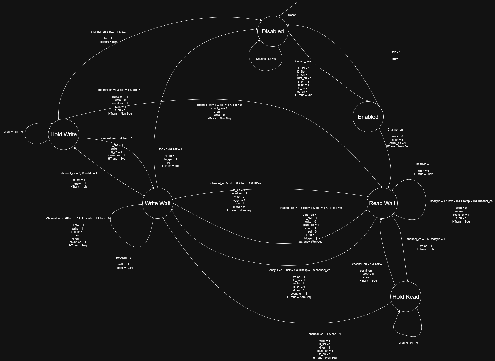

          |

### **States:**
| State        | Purpose                                                                                                                                                     |
| ------------ | ----------------------------------------------------------------------------------------------------------------------------------------------------------- |
| `Disabled`   | Indicates the DMAC Channel is not handling any Requests.                                                                                                    |
| `Enabled`    | State indicating that the internal registers of the DMAC Channel are configured.                                                                            |
| `Read Wait`  | State indicating that a read operation is going on.                                                                                                         |
| `Hold Read`  | "State indicating that the bus grant was given to the processor during a read operation, and the state remains active until the DMA channel is re-enabled.  |
| `Write Wait` | State indicating that a write operation is going on.                                                                                                        |
| `Hold Write` | "State indicating that the bus grant was given to the processor during a write operation, and the state remains active until the DMA channel is re-enabled. |

## ***Verification and Testing***
To thoroughly verify the DMAC's functionality, a Mock AHB Peripheral was designed which works just like a normal AHB peripheral and has a 1024 `byte` long register file (`8x1024`) inside it which contains the data to be transferred. Two mock peripherals were instantiated, named source and dest, which behave as the source and destination of the data to be transferred. `transfer_size` was kept at 18 and was initialized with random data in source peripheral and `burst_size` was kept at 4. The first 16 `words` were transferred in 4 bursts of 4 while the remaining 2 `words` were transferred in single mode. All three possible peripheral Requests were passed and in those requests in which `DmacReq[1]` was asserted, it was given priority. All edge cases were tested and passed successfully.

## **Waveforms**

### Dmac Configuration 
Once the DMAC receives the Bus_Grant, the peripheral begins configuring the DMAC. A base address corresponding to that peripheral is already stored in the `peri_addr_reg`, and from this base, four specific offsets are used to configure the `SAddr_Reg`, `DAddr_Reg`, `Size_Reg`, and `Ctrl_Reg`. To better reflect realistic peripheral behavior, the peripheral introduces an intentional delay of two cycles while providing these configuration values. After this delay, the DMAC captures the data and stores it into the respective registers.

### Dmac Reading 
The DMAC reads data from the peripheral in bursts of 4, while the peripheral introduces an intentional 2-clock-cycle wait before providing valid data.

### Dmac Writing 
Here the DMAC writes data to the peripheral in bursts of 4, with the peripheral introducing an intentional 2-clock-cycle wait before accepting each write.

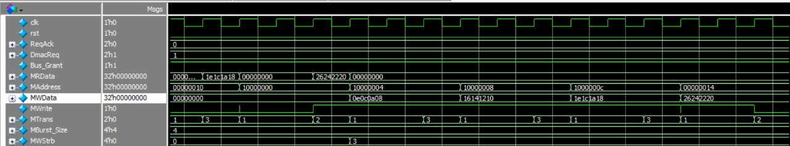

### DmacReq - 01
In this image, the `DmacReq` signal was `01`, so `Channel 2` was enabled and Interrupt was generated transfer was complete. The last 2 `word` as seen in the image are transferred via single word transfer while the remaining in bursts. `HSize` was kept as `byte` and the address offset was `3`.

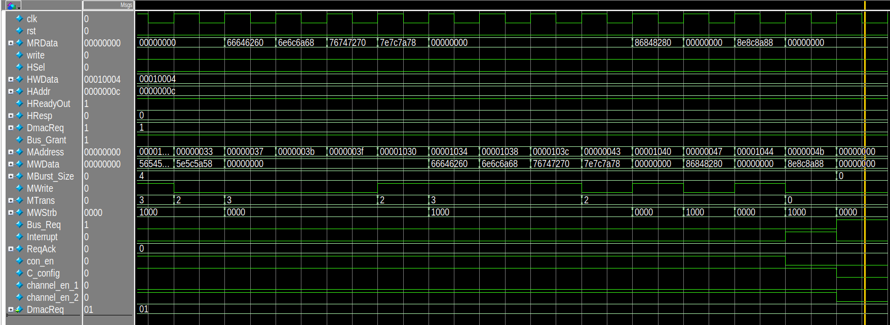

All test cases were passed as only those bytes were tested which were valid depending upon the `MWSTRB` signal. If a byte was Invalid, **Invalid Byte** was displayed.

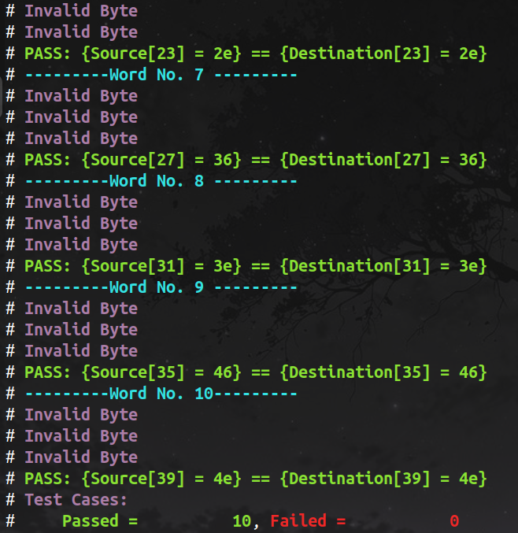

---

### DmacReq - 10
Here, `HSize` was kept as `halfword` and the address offset was kept at `2`.

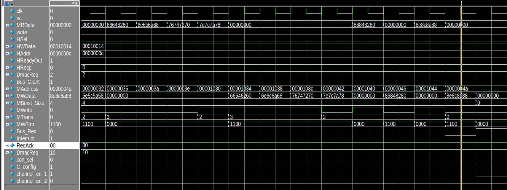

All test cases were passed depending upon the `MWSTRB` signal.

---

### DmacReq - 11
In this case, `HSize` was kept as `word` and the address offset was kept at `0`.

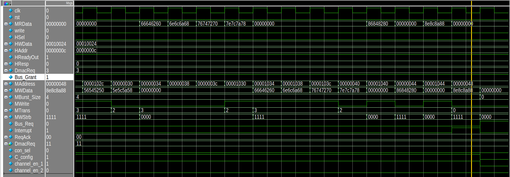

All test cases were passed while expected valid of `MWSTRB` was `1111`.

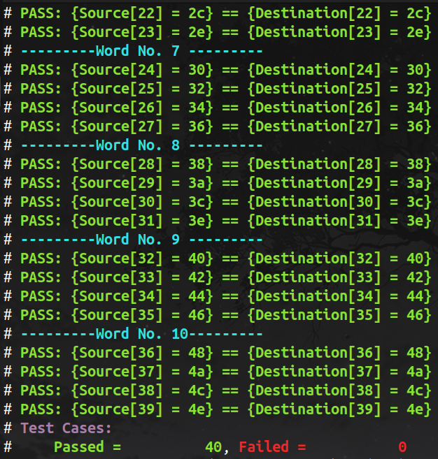

---

### Bus Grant Deasserted mid transfer
In this case, `HSize` is still `word` encoded and offset is `0` but bus grant was deasserted mid transfer for 2 clock edges.

Even though DMAC was removed as bus master, Transfer resumed after DMAC was again given the access to bus and stopped when transfer was complete.

---

# ***References***
- [AHB Bus - Documentation](https://developer.arm.com/documentation/ihi0033/latest/)
- [ARM PL081 Single Master DMAC - Documentation](https://developer.arm.com/documentation/ddi0218/e)