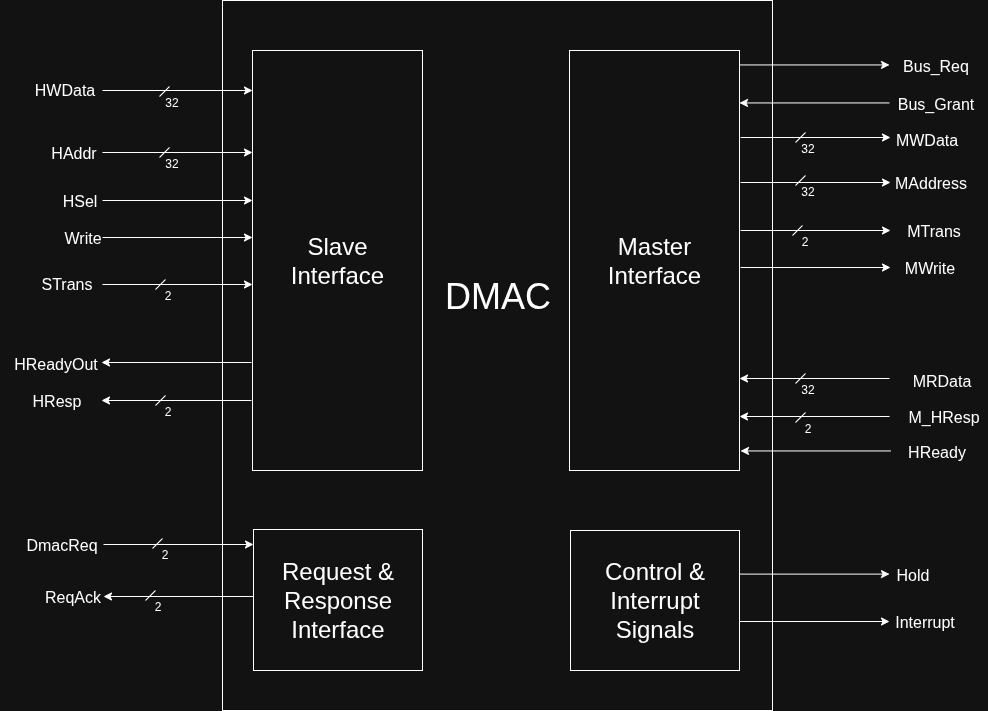

# ***AHB Direct Access Memory Controller (DMAC)***

## **Introduction**
Direct Memory Access Controller is used to allow the peripherals to directly transfer data to their required destination i.e. Memory or another peripheral without disrupting the processor. This saves the processor from handling lenghty transfers because when a CPU handles data transfers, it remains blocked and can't perform instructions. This transfer can take many cycles so to avoid this, the transfer is handed over to the DMAC along with the control of the Bus. DMAC handles the transfer while the CPU can deal with other tasks and instructions. A DMAC has two types of transfers:
- Burst Transfer
- Single Transfer

In a Burst Transfer, data is buffered in a FIFO untill burst size is reached and then transfered one-by-one untill the FIFO is empty.

## **Specifications**
- Number of Channels: 2
- Fixed Priority Channels
  - Highest priority: Channel 1
  - Lowest priortity: Channel 2
- Highest priority to DMAC[1] Request - Assigned Channel 1
- FIFO depth in Each Channel: 16 words
- Supported Peripherals/Slaves: 2
- Capable of Burst and Single transfer
- Slave Interface: For DMAC Configuration
  - 4 32-bit Registers:
    - Control Register
    - Size Register
    - Source Address Register
    - Destination Address Register
  - Registers are memory mapped
- Request and Response Interface: For peripherals

## **DMAC Pinout**

### **Signals:**
#### ***Slave Interface***
|Signals|Type|Purpose|
|-------|----|-------|
|HWData|Input|Data to be processed/stored by the slave interface|
|HAddr|Input|Address to store data in slave|
|HSel|Input|Tells the Slave that it's been selected as slave for a transaction|
|Write|Input|Tells the nature of the transfer|
|STrans|Input|Tells the state of the current request on the bus (Encodings: Idle, Busy, Seq, Non-Seq)|
|HReadyOut|Output|Signals to master that the transfer is complete|
|S_HResp|Output|Tells master if the transfer was successful or not|

#### ***Request and Response Interface***
|Signals|Type|Purpose|
|-------|----|-------|
|DmacReq|Input|Each bit indicates a request from each peripheral|
|ReqAck|Output|Request Acknowledgement Signals to each peripheral|

#### ***Control and Interrupt Interface***
|Signals|Type|Purpose|
|-------|----|-------|
|Hold|Output|Signals CPU to stop and configure the DMAC Slave|
|Interrupt|Output|Signals to CPU that transfer is complete|

#### ***Master Interface***
|Signals|Type|Purpose|
|-------|----|-------|
|Bus_Req|Output|Requests Bus' Arbiter to become Bus Master (Remains asserted until Bus_Grant is asserted)|
|Bus_Grant|Input|Signals DMAC that bus access is granted to it|
|MWData|Output|Data to write to Slave as a master|
|MAddress|Output|Address to Slave as a master|
|MTrans|Output|Tells the state of the current transfer Request on bus as a master|
|MWrite|Output|As a master, tells the slave the nature of the transfer Request|
|MRData|Input|Data Read from the Slave|
|HReady|Input|Signals DMAC that the transfer request is complete|
|M_HResp|Input|From slave to master, tells if the transfer was successful or not|
