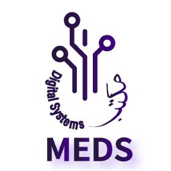
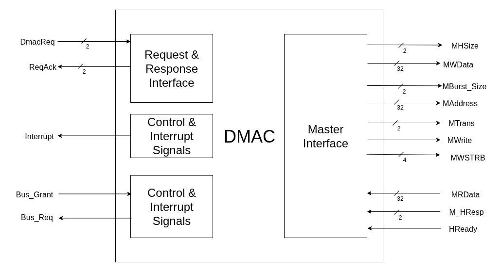

# ***AHB Direct Access Memory Controller (DMAC)***

<div style="text-align: center;">
  
</div>

> Efficient, configurable AMBA-AHB compliant DMA engine supporting burst/block transfers and CPU offloading for high-performance embedded systems.

--- 

## Top Level Architecture



---

## Key Features
- Fixed Priority Channels
  - Highest priority: `Channel 1`
  - Lowest priortity: `Channel 2`
- Supports 2 Peripherals/Slaves.
- Capable of Burst and Single transfer
- Supports Burst Transfer of maximum `16 beats.`
- Request and Response Interface for peripherals.
- If CPU asks for bus access, burst transfer is halted until bus access is granted again.


---
## Getting Started 

```bash
# Prerequisites: ModelSim & Make installed

# 1. Clone the repo
git clone https://github.com/meds-ee-uet/AHB-DMA-Controller
cd AHB-DMA-Controller

# 2. Compile the design
make compile

# 3. Run simulation
make simulate

# 4. Check Waveforms
make wave
```